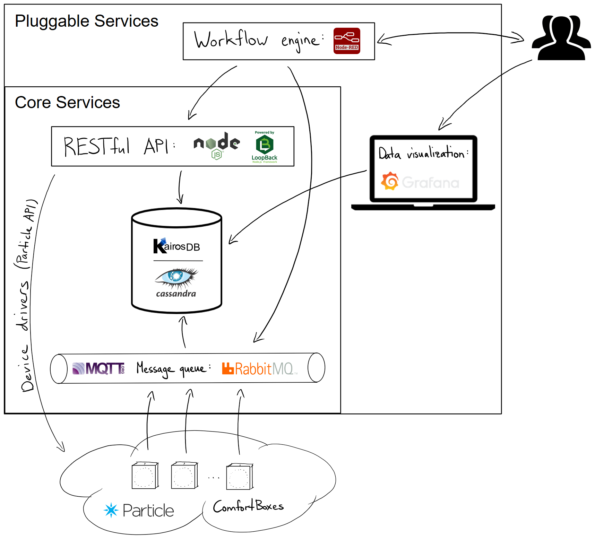
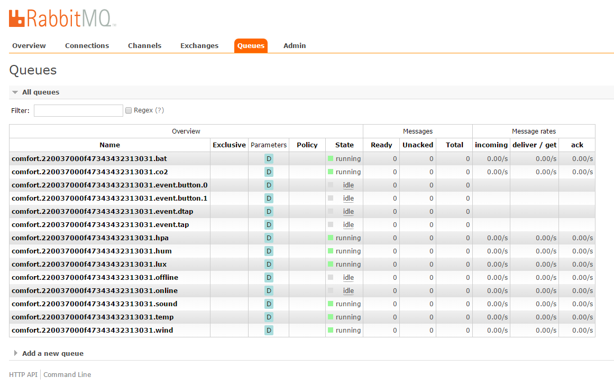
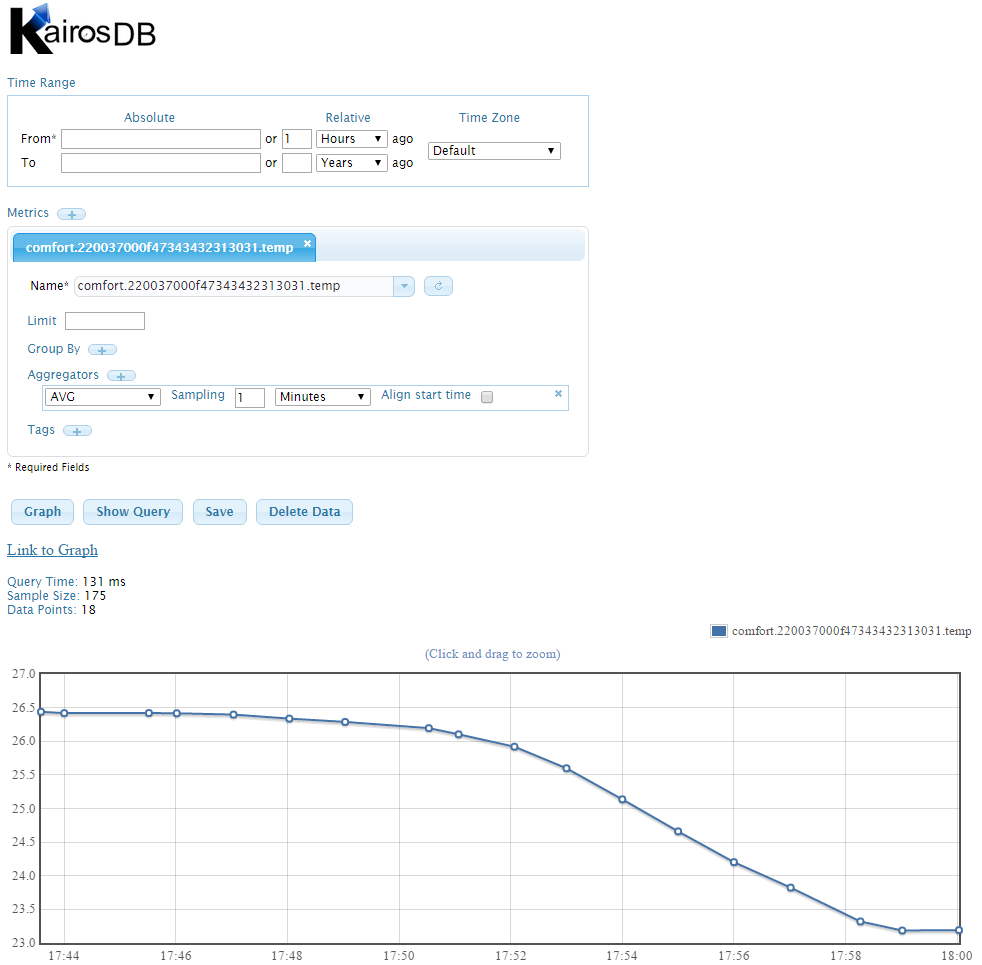
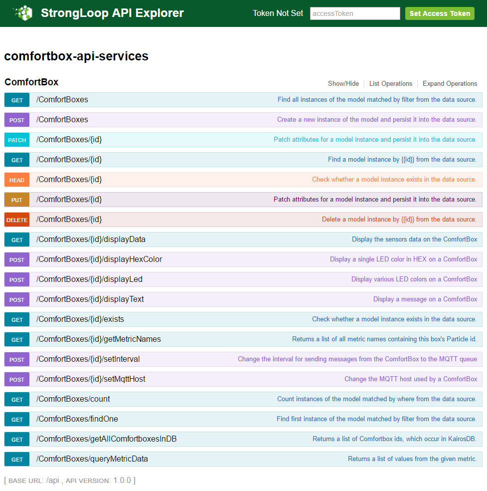
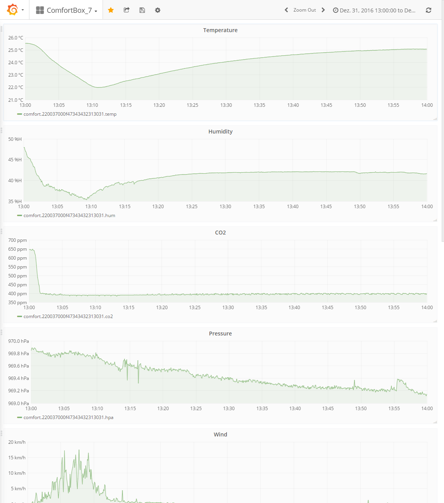

# comfortbox-api-services
This is the source code repository for my Master's thesis project: RESTful services and automation for comfort-oriented smart devices.

In a nutshell, the goal of this project is to build up proper data-storage and a well-defined RESTful API for ComfortBoxes. Furthermore, I want to add some additional value by allowing to integrate a ComfortBox into Node-RED workflows (see repository [node-red-contrib-comfortbox](https://github.com/dwettstein/node-red-contrib-comfortbox)).

If you are more interested in the ComfortBox itself, please have a look at the GitHub repository here:  https://github.com/DurandA/comfortbox

### Big picture


### Screenshots
| RabbitMQ                                | KairosDB                                | API Explorer                                    | Grafana                               |
|-----------------------------------------|-----------------------------------------|-------------------------------------------------|---------------------------------------|
|  |  |  |  |


---
## Installation
For setting up RabbitMQ, KairosDB and (optionally) Grafana, take a look at the [server documentation](./docs/setup_server.md).

As the ComfortBox API is a Node.js application, you need to install Node.js in advance of course. Please have a look at their documentation for that: [Installing Node.js via package manager](https://nodejs.org/en/download/package-manager/#debian-and-ubuntu-based-linux-distributions)

Before you install the ComfortBox API, install the database with the following commands:

```bash
sudo apt-get install postgresql

su postgresql

createuser -P comfortboxapi
# Enter the password (e.g. comfortboxapi)
createdb comfortboxapi

psql
# postgres=# grant all privileges on database comfortboxapi to comfortboxapi;
# \q
```

Installing the ComfortBox API itself is easily done:
- Copy or clone the repository
- Install the dependencies by running `npm install`

### Configuration
After finishing the complete server installation, you need to configure the API services by editing the following two files, before you can use it.
- `./server/config.json` \- Update the values for:
    - defaultUsername
    - defaultPassword
    - defaultEmail
    - defaultAccessToken
    - certificatePath
    - privateKeyPath
    - rabbitMqServer
    - pathToKairosBindings
    - \[Optional\] host, port, url
- `./server/datasources.json` \- Update the values for:
    - ParticleAPI Authorization ([Bearer access token](https://docs.particle.io/reference/api/#generate-an-access-token) from account with your ComfortBox devices)
    - KairosDB baseURL (hostname of certificate)
    - KairosDB Authorization
    - KairosDB url for each operation (hostname of certificate)
- `./server/datasources.production.json` \- Update the values for (not needed if you have setup the DB as written above):
    - DB (PostgreSQL)

### Run it
During development you can run the API with `node .` or `nohup node . &`.

However, for production I recommend setting up a _systemd_ service using the example [comfortbox-api.service](./configs/comfortbox-api.service):
1. If the path to the `node` command is not `/usr/bin/node`, update it with the value from `which node`
2. Copy the file to the `/etc/systemd/system` directory
3. Reload daemon: `sudo systemctl daemon-reload`
4. Enable autostart: `sudo systemctl enable comfortbox-api.service`
5. Start the service: `sudo systemctl start comfortbox-api.service`
6. Check the status with `sudo systemctl status comfortbox-api.service`

#### Production
Before running the API in production, you have to create the DB tables by running the script `automigrate.js`:

```bash
node bin/automigrate.js
```


---
## How to use the API
First, have a look at the API Swagger documentation on `https://localhost:3000/explorer/` (change localhost to your hostname if needed).
Every request to the API needs to be authenticated with a token. Initially, you can use the default user or token defined in `./server/config.json`.

### Register a new box
Before you can configure a ComfortBox or query data from it, you need to register it within the API.
You can do that by requesting `POST /ComfortBoxes` with the necessary data from your ComfortBox (at least the Particle ID of your device).

If your ComfortBox is already configured to send its messages to the MQTT installation of the API service, then it will be auto-registered as soon as it sends the `comfort.{{particleId}}.online` message.

### Set MQTT host
After the registration of a ComfortBox to the API, you can configure it.
As an example, you can set the MQTT host by requesting `POST /ComfortBoxes/{id}/setMqttHost` along with the host and port of the MQTT installation.

### Query data
As soon as the registered ComfortBox sends the `comfort.{{particleId}}.online` message to the MQTT installation of the API service, the message queues and bindings will be created and you can query the device's data afterwards.
To see which metrics of a device are available simply request `GET /ComfortBoxes/{id}/getMetricNames`. Then you can query a metric by requesting `POST /ComfortBoxes/queryMetricData` and the corresponding metric name.


---
## Use the API services within your Node-RED flows
For using the API services within Node-RED workflows, have a look at the repository [node-red-contrib-comfortbox](https://github.com/dwettstein/node-red-contrib-comfortbox). There, you can also find some example flows.


---
## Development - Run the tests
For running the unit tests, just run `npm install` and `npm test` or directly `./node_modules/.bin/mocha` in the root folder.

The tests use the following libraries:
- [mocha](https://mochajs.org/)
- [chai](http://chaijs.com/)
- [supertest](https://github.com/visionmedia/supertest)

Inspired by: https://stackoverflow.com/questions/35005001/loopback-testing-with-supertest-mocha-and-models#35256151

---
The API is created with [LoopBack](http://loopback.io).
